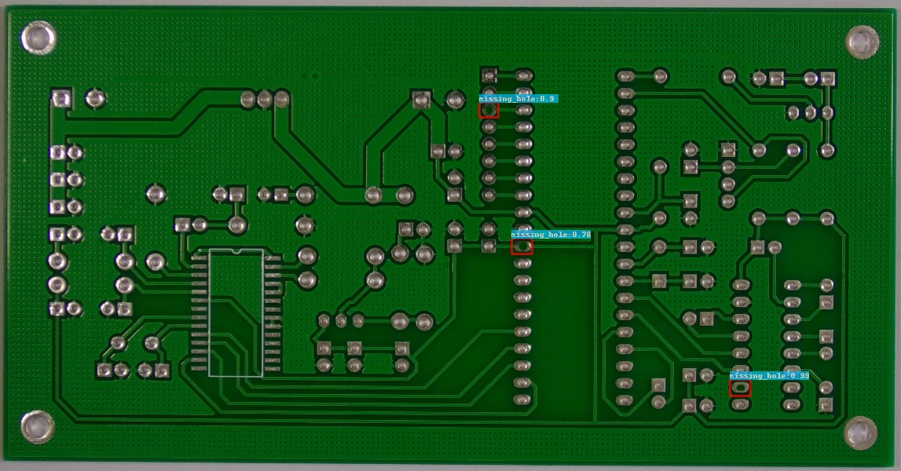
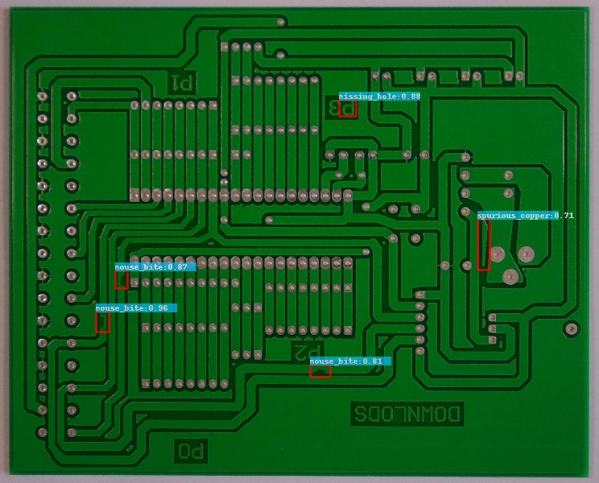
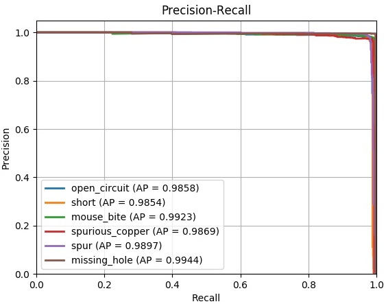

# PCB-defect-detection
## Note 
This project code is forked from https://github.com/DetectionTeamUCAS/FPN_Tensorflow. I have only made minor changes on this wonderful and clear project. Thanks for their perfect code. I can learn and apply it to a new problem. The Chinese blog is: https://blog.csdn.net/dlh_sycamore/article/details/87886198
##  PCB Defect Dataset
The Open Lab on Human Robot Interaction of Peking University has released the PCB defect dataset. If you need to do experiments on this dataset, please contact the dataset author. 

You can download at http://robotics.pkusz.edu.cn/resources/dataset/. or https://www.dropbox.com/s/32kolsaa45z2mpj/PCB_DATASET.zip?dl=0


6 types of defects are made by photoshop, a graphics editor published by Adobe Systems. The defects defined in the dataset are: missing hole, mouse bite, open circuit, short, spur, and spurious copper. 
For example:

.png)
### Augmented Dataset
However, the defect images of raw dataset are high-resolution. 
With the respect of such small dataset, data augmentation techniques are adopted before data training. The images are then cropped
into 600 × 600 sub-images, forming our training set and testing set with 9920 and 2508 images, respectively. 
You can download augmented dataset: 
  
(1) For Baiduyun: https://pan.baidu.com/s/1eAxDF4txpgMInxbmNDX0Zw code: a6rh 

(2) For Dropbox: https://www.dropbox.com/s/h0f39nyotddibsb/VOC_PCB.zip?dl=0 
  
The augmented dataset contains 10668 images and the corresponding annotation files. 
If you use our dataset in your paper, please cite our paper. 
  
R. Ding, L. Dai, G. Li and H. Liu, "TDD-net: a tiny defect detection network for printed circuit boards," in CAAI Transactions on Intelligence Technology, vol. 4, no. 2, pp. 110-116, 6 2019, doi: 10.1049/trit.2019.0019. 

### Some Instructions: 

1、If you have questions, please open an issue, I will reply as soon as possible. If you don't have some difficult problem about this project, maybe you **don't need** to send me an email and add wechat, just open an issue.

2、Of course, if you have other research questions like dataset and defect detection, welcome to send me an email.

3、If you use our code, please access this paper and cite: 
Ding, Runwei, et al. "TDD-Net: A Tiny Defect Detection Network for Printed Circuit Boards." CAAI Transactions on Intelligence Technology (https://ieeexplore.ieee.org/document/8757220)(2019).

4、Chinese Blog: https://blog.csdn.net/dlh_sycamore/article/details/87886198

## Download Model
Please download [resnet50_v1](http://download.tensorflow.org/models/resnet_v1_50_2016_08_28.tar.gz)、[resnet101_v1](http://download.tensorflow.org/models/resnet_v1_101_2016_08_28.tar.gz) pre-trained models on Imagenet, put it to $PATH_ROOT/data/pretrained_weights. 
## My Development Environment
1、python3.6 (anaconda/pipenv recommend)             
2、CUDA Version 8.0.44 , CUDNN=5.1.10           
3、[opencv(cv2)](https://pypi.org/project/opencv-python/)    
4、[tfplot](https://github.com/wookayin/tensorflow-plot)             
5、tensorflow == 1.121 

## Compile
```bash
git clone https://github.com/Ixiaohuihuihui/Tiny-Defect-Detection-for-PCB.git
cd Tiny-Defect-Detection-for-PCB

# pipenv --python 3.6

pip install -r requirements.txt
# pipenv run pip install -r requirements.txt

cd ${PWD}/libs/box_utils/cython_utils
python setup.py build_ext --inplace
# pipenv run python setup.py build_ext --inplace

```

## Demo(available)

Then download the corresponding weights:

For Baiduyun: [weights](https://pan.baidu.com/s/1rvHjihG1fL499SqU28Nang). code：shac 

For Google driver: [weights](https://drive.google.com/drive/folders/1oEHrEslnM5DBKB-610j-gO-x9-e90VwR?usp=sharing)


And then put the trained weights into 
```
TRAINED_CKPT = os.path.join(ROOT_PATH, 'output/trained_weights')
```
It depends on your project path. Please read '$PWD/libs/configs/cfgs.py'.

```   
mkdir -p ./input ./output

cd $PWD/tools

python inference.py --data_dir='../input' 
                    --save_dir='../output' 
                    --GPU='0'
```
After running this code, you will get the detected image in your 'save_dir' path.

Why didn't you get the correct output image when run the inference.py?

**Note!!! If you didn't load the correct checkpoint but the pretrain model, you need to change the checkpoint file (FPN_Res101_0117_OHEM/checkpoint), because this file contains the wrong path, and you need to change it with your file path!!!**

## Train
If you want to train your own data, please follow this project: https://github.com/DetectionTeamUCAS/FPN_Tensorflow

1、Select a configuration file in the folder ($PATH_ROOT/libs/configs/) and copy its contents into cfgs.py. Modify parameters (such as CLASS_NUM, DATASET_NAME, VERSION, etc.) in $PATH_ROOT/libs/configs/cfgs.py    

2、Generate train and test floder

```  
cd $PATH_ROOT/data/io/  
python divide_data.py 
```    
You should check the image_path and xml_path in the 'divide_data.py'

2、Make tfrecord 

(1)Modify parameters (such as VOC_dir, xml_dir, image_dir, dataset, etc.) in $PATH_ROOT/data/io/convert_data_to_tfrecord.py   
```  
cd $PATH_ROOT/data/io/  
python convert_data_to_tfrecord.py 
```     

3、Train
```  
cd $PATH_ROOT/tools
python train.py
```

## Eval
```  
cd $PATH_ROOT/tools
python eval.py --eval_imgs='/PATH/TO/THE/TO/BE/EVALED/IMAGES/'  
               --annotation_dir='/PATH/TO/TEST/ANNOTATION/'
               --GPU='0'
```   
After running this code, you will get the precision, recall and AP of per defect type.

## Some results 
[the more results](https://github.com/Ixiaohuihuihui/PCB-defect-detection/tree/master/tools/inference_results)



## The Precision and Recall curve (PR)

